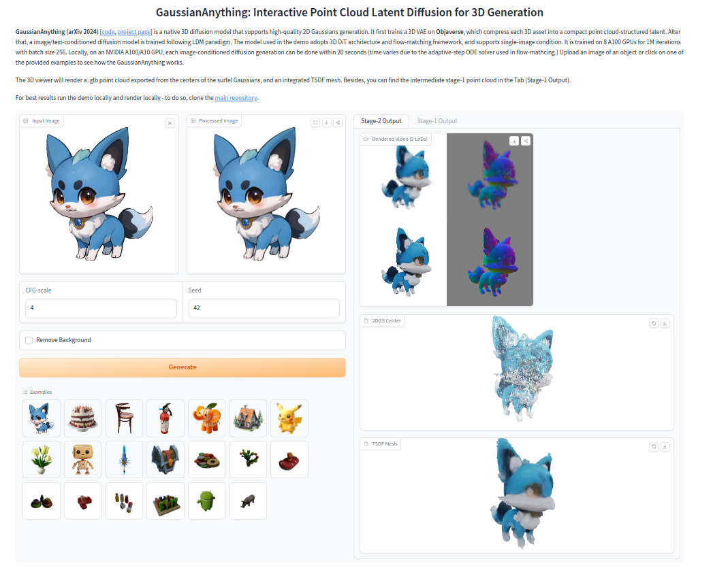

<div align="center">

<h1>
GaussianAnything: Interactive Point Cloud Latent Diffusion for 3D Generation (ICLR 2025)
</h1>

<div>
    <a href='https://nirvanalan.github.io/' target='_blank'>Yushi Lan</a><sup>1</sup>&emsp;
    <a href='https://shangchenzhou.com/' target='_blank'>Shangchen Zhou</a><sup>1</sup>&emsp;
    <a href='https://zhaoyanglyu.github.io/' target='_blank'>Zhaoyang Lyu</a><sup>1</sup>&emsp;
    <a href='https://hongfz16.github.io' target='_blank'>Fangzhou Hong</a><sup>1</sup>&emsp;
    <a href='https://williamyang1991.github.io/' target='_blank'>Shuai Yang</a><sup>2</sup>&emsp;
    <br>
    <a href='https://daibo.info/' target='_blank'>Bo Dai</a>
    <sup>3</sup>
    <a href='https://xingangpan.github.io/' target='_blank'>Xingang Pan</a>
    <sup>1</sup>
    <a href='https://www.mmlab-ntu.com/person/ccloy/' target='_blank'>Chen Change Loy</a>
    <sup>1</sup> &emsp;
</div>
<div>
    S-Lab, Nanyang Technological University<sup>1</sup>;
    <!-- &emsp; -->
    <br>
    Wangxuan Institute of Computer Technology, Peking University<sup>2</sup>;
    <br>
    <!-- &emsp; -->
    Shanghai Artificial Intelligence Laboratory <sup>3</sup>
    <!-- <br>
     <sup>*</sup>corresponding author -->
</div>
<!-- <br> -->
<div>
<a href="https://hits.seeyoufarm.com"></a>
</div>
<!-- <br> -->
<!-- <h4> -->
<strong>
GaussianAnything generates <i>high-quality</i> and <i>editable</i> surfel Gaussians through a cascaded native 3D diffusion pipeline, given single-view images or texts as the conditions.
</strong>


https://github.com/user-attachments/assets/988ea293-b3ed-41d4-87e9-a20c89bfef98


<!-- <br> -->

For more visual results, go checkout our <a href="https://nirvanalan.github.io/projects/GA/" target="_blank">project page</a> :page_with_curl:

<strike>
Codes coming soon :facepunch:
</strike>

This repository contains the official implementation of GaussianAnything: Interactive Point Cloud Latent Diffusion for 3D Generation

</div>

---

<h4 align="center">
  <a href="https://nirvanalan.github.io/projects/GA/" target='_blank'>[Project Page]</a>
  •
  <a href="https://arxiv.org/abs/2411.08033" target='_blank'>[arXiv]</a>
  •
  <a href="https://huggingface.co/spaces/yslan/GaussianAnything-AIGC3D" target='_blank'>[Gradio Demo]</a> 
</h4>


## Abstract

<p> While 3D content generation has advanced significantly, existing methods still face challenges with
            input formats, latent space design, and output representations. This paper introduces a novel 3D
            generation framework that addresses these challenges, offering scalable, high-quality 3D generation
            with an interactive <i>Point Cloud-structured Latent</i> space. Our framework employs a
            Variational Autoencoder (VAE) with multi-view posed RGB-D(epth)-N(ormal) renderings as input, using
            a unique latent space design that preserves 3D shape information, and incorporates a cascaded latent
            diffusion model for improved shape-texture disentanglement. The proposed method, GaussianAnything,
            supports multi-modal conditional 3D generation, allowing for point cloud, caption, and
            single/multi-view image inputs. Notably, the newly proposed latent space naturally enables
            geometry-texture disentanglement, thus allowing 3D-aware editing. Experimental results demonstrate
            the effectiveness of our approach on multiple datasets, outperforming existing methods in both text-
            and image-conditioned 3D generation.</p>


## :mega: Updates

[24/Jan/2025] GaussianAnything is accepted by ICLR 2025!

[28/Nov/2024] Release gradio demo (Huggingface ZeroGPU), which supports image-to-3D generation: <a href="https://huggingface.co/spaces/yslan/GaussianAnything-AIGC3D"></a>
<!-- [here](https://huggingface.co/spaces/yslan/GaussianAnything-AIGC3D)! -->

[27/Nov/2024] Release gradio demo (local version), which supports image-to-3D generation. Simply call ```python scripts/gradio_app_cascaded.py```.

[27/Nov/2024] Support colored point cloud (2D Gaussians centers) and TSDF mesh export. Enabled by default```--export_mesh True```.

[24/Nov/2024] Inference code and checkpoint release.

[13/Nov/2024] Initial release.


<!-- ### Demo

Check out our online demo on [Gradio space](https://huggingface.co/spaces/yslan/LN3Diff_I23D). To run the demo locally, simply follow the installation instructions below, and afterwards call 

```bash 
bash shell_scripts/final_release/inference/gradio_sample_obajverse_i23d_dit.sh
``` -->

### :dromedary_camel: TODO

- [x] Release inference code and checkpoints.
- [x] Release Training code.
- [x] Release pre-extracted latent codes for 3D diffusion training.
- [x] Release Gradio Demo (locally).
- [x] Release Gradio Demo (Huggingface ZeroGPU) for image-to-3D generation, check it [here](https://huggingface.co/spaces/yslan/GaussianAnything-AIGC3D)!
- [ ] Release the evaluation code.
- [ ] Lint the code.

<!-- 
- [Overview](#overview)
  * [Abstract](#abstract)
  * [Examples](#examples)
  * [Method](#method)
- [Running the code](#running-the-code)
  * [Dependencies](#dependencies)
  * [Data](#data)
  * [Training](#training)
  * [Sampling](#sampling)
  * [Pretrained checkpoints](#pretrained-checkpoints)
  * [Common issues](#common-issues)
- [Acknowledgement](#acknowledgement)
- [Citation](#bibtex)
- [Contact](#contact) -->


# Inference

## setup the PyTorch environment (the same env as [LN3Diff, ECCV 2024](https://github.com/NIRVANALAN/LN3Diff?tab=readme-ov-file))

```bash
# download
git clone https://github.com/NIRVANALAN/GaussianAnything.git

# setup the pytorch+xformers+pytorch3d environment
conda create -n ga python=3.10
conda activate ga
pip install -r requirements.txt 
pip install "git+https://github.com/facebookresearch/pytorch3d.git@stable"
```

Then, install the 2DGS dependencies:
```bash
pip install "git+https://github.com/hbb1/diff-surfel-rasterization.git"
pip install "git+https://gitlab.inria.fr/bkerbl/simple-knn.git"
```

## Gradio demo (Image-to-3D)

For image-to-3D generation with GaussianAnything, we have provided a gradio interface. After setting up the environment, please run ```python scripts/gradio_app_cascaded.py``` to launch the gradio locally. The code has been tested on V100 32GiB GPU.



<!-- Then, install pytorch3d with 
```bash
pip install git+https://github.com/facebookresearch/pytorch3d.git@stable
``` -->

## Checkpoints

* All diffusion checkpoints will be automatically loaded from [huggingface.co/yslan/GaussianAnything](https://huggingface.co/yslan/GaussianAnything/tree/main).
* The results will be directly dumped to ```./logs```, and can be modified by changing ```$logdir``` in the bash file accordingly.

<!-- To load the checkpoint automatically: please replace ```/mnt/sfs-common/yslan/open-source``` with ```yslan/GaussianAnything/ckpts/checkpoints```. -->

To set the CFG score and random seed, please update ```$unconditional_guidance_scale$``` and ```$seed$``` in the bash file.


## I23D (requires two stage generation):

set the ```$data_dir``` accordingly. For some demo image, please download from [huggingfac.co/yslan/GaussianAnything/demo-img](https://huggingface.co/yslan/GaussianAnything/tree/main/demo-img). We have also included the demo images shown in the paper in ```./assets/demo-image-for-i23d/instantmesh``` and ```./assets/demo-image-for-i23d/gso```. 

In the bash file, we set ```data_dir="./assets/demo-image-for-i23d/instantmesh"``` by default.

**stage-1** (point cloud generation):
```
bash shell_scripts/release/inference/i23d/i23d-stage1.sh
```

The sparse point cloud wll be saved to, e.g., ```logs/i23d/stage-1/dino_img/house2-input/sample-0-0.ply```. Note that ```$num_samples$``` samples will be saved, which is set in the bash file.

Then, set the ```$stage_1_output_dir``` to the ```$logdir``` of the above stage.

**stage-2** (2D Gaussians generation): 
```
bash shell_scripts/release/inference/i23d/i23d-stage2.sh
```

In the output dir of each instance, e.g., ```./logs/i23d/stage-2/dino_img/house2-input```, the code dumped the colored point cloud extracted from the surfel Gaussians center (xyz+RGB) ```sample-0-0-gaussian-pcd.ply```, as well as the TSDF mesh ```stage1ID_0-stage2ID-0-mesh.obj```:


Both can be visualized by meshlab.


## Text-2-3D (requires two stage generation):

Please update the caption for 3D generation in ```datasets/caption-forpaper.txt```. T o change the number of samples to be generated, please change ```$num_samples``` in the bash file.

**stage-1** (point cloud generation):
```
bash shell_scripts/release/inference/t23d/stage1-t23d.sh
```
then, set the ```$stage_1_output_dir``` to the ```$logdir``` of the above stage.

**stage-2** (2D Gaussians generation): 
```
bash shell_scripts/release/inference/t23d/stage2-t23d.sh
```

The results will be dumped to ```./logs/t23d/stage-2```

## 3D VAE Reconstruction:

To encode a 3D asset into the latent point cloud, please download the pre-trained VAE checkpoint from [huggingfac.co/yslan/gaussiananything/ckpts/vae/model_rec1965000.pt](https://huggingface.co/yslan/GaussianAnything/blob/main/ckpts/vae/model_rec1965000.pt) to ```./checkpoint/model_rec1965000.pt```.

Then, run the inference script

```bash 
bash shell_scripts/release/inference/vae-3d.sh
```

This will encode the mulit-view 3D renderings in ```./assets/demo-image-for-i23d/for-vae-reconstruction/Animals/0``` into the point-cloud structured latent code, and export them (along with the 2dgs mesh) in ```./logs/latent_dir/```. The exported latent code will be used for efficient 3D diffusion training. 

Note that if you want to use the pre-extracted 3D latent codes, please check the following instructions.


# Training (Flow Matching 3D Generation)
All the training is conducted on 8 A100 (80GiB) with BF16 enabled. For training on V100, please use FP32 training by setting ```--use_amp``` False in the bash file. Feel free to tune the ```$batch_size``` in the bash file accordingly to match your VRAM.
To enable optimized RMSNorm, feel free to install [Apex](https://github.com/NVIDIA/apex?tab=readme-ov-file#linux).


To facilitate reproducing the performance, we have uploaded the pre-extracted poind cloud-structured latent codes to the [huggingfac.co/yslan/gaussiananything/dataset/latent.tar.gz](https://huggingface.co/yslan/GaussianAnything/blob/main/dataset/latent.tar.gz) (34GiB required). Please download the pre extracted point cloud latent codes, unzip and set the ```$mv_latent_dir``` in the bash file accordingly.


## Text to 3D:
Please donwload the 3D caption from hugging face [huggingfac.co/yslan/GaussianAnything/dataset/text_captions_3dtopia.json](https://huggingface.co/yslan/GaussianAnything/blob/main/dataset/text_captions_3dtopia.json), and put it under ```dataset```.


Note that if you want to train a specific class of Objaverse, just manually change the code at ```datasets/g_buffer_objaverse.py:3043```.

**stage-1 training (point cloud generation)**:

```
bash shell_scripts/release/train/stage2-t23d/t23d-pcd-gen.sh
```

**stage-2 training (point cloud-conditioned KL feature generation)**:

```
bash shell_scripts/release/train/stage2-t23d/t23d-klfeat-gen.sh
```

## (single-view) Image to 3D
Please download g-buffer dataset first.

**stage-1 training (point cloud generation)**:

```
bash shell_scripts/release/train/stage2-i23d/i23d-pcd-gen.sh
```

**stage-2 training (point cloud-conditioned KL feature generation)**:

```
bash shell_scripts/release/train/stage2-i23d/i23d-klfeat-gen.sh
```


## BibTex
If you find our work useful for your research, please consider citing the paper:
```
@inproceedings{lan2024ga,
  title={GaussianAnything: Interactive Point Cloud Latent Diffusion for 3D Generation},
  author={Yushi Lan and Shangchen Zhou and Zhaoyang Lyu and Fangzhou Hong and Shuai Yang and Bo Dai and Xingang Pan and Chen Change Loy},
  year={2025},
  booktitle={ICLR},
} 
```


## :newspaper_roll:  License

Distributed under the NTU S-Lab License. See `LICENSE` for more information.

## :heart:  Acknowledgement

Our flow-mathcing training code is built on [SiT](https://github.com/willisma/SiT), and the rendering code is from [2DGS](https://github.com/hbb1/2d-gaussian-splatting). The training dataset (Objaverse-V1) rendering is provided by [G-Buffer Objaverse](https://aigc3d.github.io/gobjaverse/). Also, we thank all the [3D artists](https://poly.pizza/u/jeremy) who have shared their created 3D assets under CC license for the academic use.

Also, this work is built on our previous work on the native 3D diffusion generative model, [LN3Diff, ECCV 2024](https://github.com/NIRVANALAN/LN3Diff?tab=readme-ov-file). Please feel free to have a check.


## Contact

If you have any question, please feel free to contact us via `lanyushi15@gmail.com` or Github issues.
